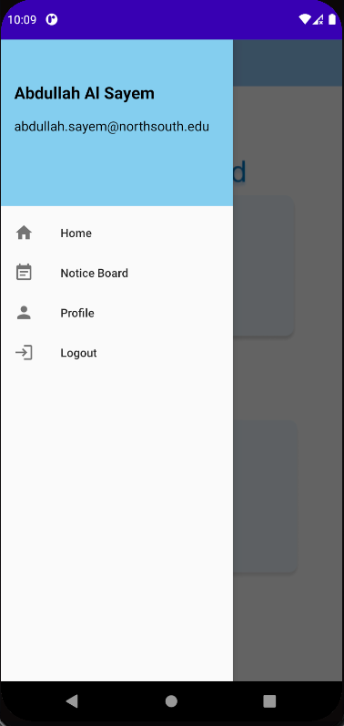

# Project Name: The CPC App 
### Course: CSE 486  
### Section: 01  
### Semester: Spring 2021 

### Faculty Name: Shaikh Sawon Arefin Shimon
---

 

### Student Name: Abdullah Al Sayem   
### Student ID: 1721655642 
### Email: abdullah.sayem@northsouth.edu 

 

### Date prepared: 26/05/2021  

## Table of Contents 

<ol>
<a href="#intro"><li><h3>Introduction</h3></li></a> 
<a href="#features"><li><h3>Features</h3></li></a> 
<a href="#data"><li><h3>Data Management</h3></li></a> 
<a href="#design"><li><h3>Design Pattern</h3></li></a> 
<a href="#road"><li><h3>Roadblocks</h3></li></a> 

</ol>

---

 

<h2 id=intro>Introduction</h2> 

  The CPC App was developed for Carrier & Placement Center of North South University. This app will help students find job offered by companies. Using this app students can easily apply for jobs posted by CPC and send their resume to CPC for filtering process. This app also support admin login, CPC admins can create, delete, update job posts using this app.
  

 

<h2 id=features>Features</h2> 

### Student Registration  

Only students of North South University can register with this app.
 

  

### Login  

Both admins and students can login from the app.
 

  

### Student Home Screen  

Home screen for student users.
 

  

### Student Side-menu  

Side-menu for student users to navigate & logout
 
  

### Student Profile  

Students can edit/update their information from profile. They can also upload resume to firebase server from their profile.
 
 
  

### Notice Board  

Notice Board to see all jobs posted by CPC.
 
  

### Job Details  

Whenever a job post is tapped from notice board list another activity with post details will open. Where students can apply for that job.
 
  

### Admin Dashboard  

Admin dashboard will be only avilable to admins when they login. From here they can add, delete job posts and events.
 
  

### Admin Side-menu  

Admin side-menu to navigate & logout.
 
  

### Admin Job Post  

Admin job post activity to post jobs with description. Only PDF & image files are allowed for job description.
 
  

 

